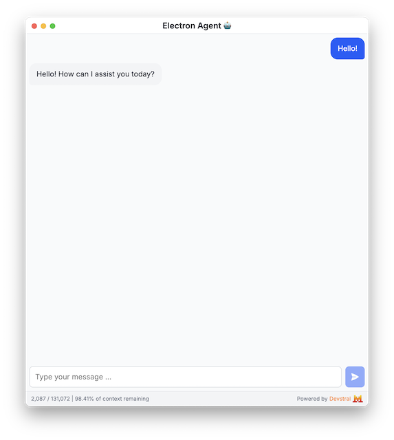

# Electron Agent 🤖

Electron Agent 🤖 is an AI-powered agentic coding chat application. I started building this to gain some experience with Electron, Mistral AI, and building agents.

## Tech Stack

This is an Electron app bootstrapped with Electron Forge using the Vite + TypeScript template:

- Electron
- Vite
- TypeScript
- React
- Tailwind CSS
- Mistral AI (https://github.com/mistralai/client-ts)

Why not use Vercel's AI SDK? Well, it looks amazing and would probably simplify things, but I wanted to get some experience building an agentic tool "from scratch" first before seeing what the AI SDK can do.
